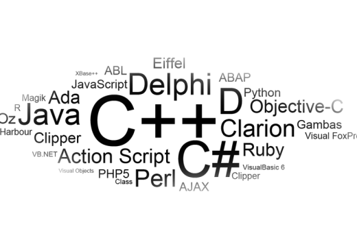
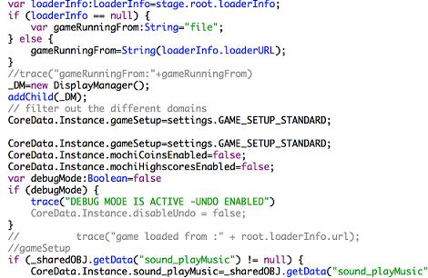

League of ledengs is a game from Riot Games company.  I have played LOL for 4 years and noticed its attraction which engages people to play it.  Furthermore, it is not only a game that kills my time, but also gives me a lot of ideas that how to be a good programmer.  This game used multiple programming languages such as C++ (the core game is written in this), Lua (core game) ,C# (game tools), ActionScript (game hud and pvp.net) ,Java (platform servers) ,Erlang (platform servers), Php/sql (web team / platform).  I studied C, C++ and Java before but it was hard especially C and C++.  Therefore, there is a long way that I can reach that level to program a game.

