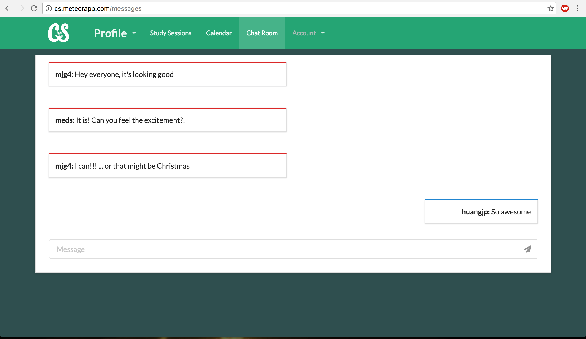

### Introduction

Collaborative Study (CS) is a scheduling app designed for UH ICS students to plan study sessions together. CS aims for ICS majors to form connections and better one another as students. The landing page briefly states what this app does and where students meet.  The app is developed by [Chad Morita](https://github.com/chadmorita), [Mariah Gaoiran](https://github.com/mariahgaoiran),[Mary Santabarbara](https://github.com/marysantabarbara) and myself.

####public landing page

####after students login, it shows up more tabs and users profile.

####calendar page shows every study session which is available that student can join.

####study session page shows all study sessions and also they can be searched by certain course.

####group page allows students build group for gathering people who have same interests and share their ideas and works

####chat room is available for everyone chat in this page. Share your ideas and excellent thoughts!!!

Reivew more about this application : [Collaborative Study](https://collaborativestudy.github.io/)

### Contribution

For this project,first of all, I created landing page for public users and home page for login users, which all of us change on the home page to make it looks better and organized.  Then, study session page took me long time for the search part javascript.  In order to make it work, I tested pretty much times and asked my team help.  Another page which is studs/pros page is not used because it needs every user information and prints out who is studying certain classes or professional of classes.  Since it requires users imformation, we decided to remove it.  There is one more page that I made is "not-found" page that shows users the page is not found and also a click which jumps back to home page.

  </img>
  </img>
 

### Reflection

I have learned Java and C before in other classes but I have never used them in a certain application.  However, This project in this class provides a perfect platform that I can develop my programming experience in my real life. I build something for people and earn much knowledge that I never had.  This project is developed by Meteor which is I am not so famliar with when I started.  Until I accomplished the project, I can masterly use with Meteor.  The most important I learned from the project is teamwork.  Different from individual, working with teammates is not I only need to focus on my own part of work but the more I should talk with teammates and share ideas, duties and processes.  For instance, because I did not tell my team members I was doing a certain iusse and someone was working at same time, it caused conflicts on the project and also wasted our valuable time.  Lacking of communication with team members causes ineffective outcomes and sometimes brings problems.  Therefore, I realized I should keep organization and let other know what I am working on is significant when working in team.  It was a great experience working with teammates and I learned a lot.
